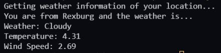

# Weather Report Project



This application prints out the weather in the location where the user is from. The application takes the user's IP address to get the location which will be used to fetch the weather datal. It fetches data from [ClimaCell](https://www.tomorrow.io/)'s Weather API.

## Prerequisites
- Create an account at [tomorrow.io](https://www.tomorrow.io/). (*A free account is sufficient for this project*)

## Functions

**get_location()** - gets the user's location by fetching the data from http://ipinfo.io/json through IP address. It prints out the user's city and returns the location (longitude and latitude) values of the JSON data.

**get_weather()** - fetches an API from [ClimaCell](https://www.tomorrow.io/)'s Weather API. ClimaCell provided different solutions on how to use their API. 

For simplicity sake, first, you need to define the end_point and user api_key. Second, you have to specify the timesteps *(current, 1h, 1d)* and define the [fields](https://docs.tomorrow.io/reference/data-layers-overview) you want to fetch from the end point. Lastly, you send a **post** request to the end point with all the data defined by using the **requests** library.

```python
body = {"location": coordinates, "timesteps": timesteps, "units": "metric", "fields": fields}
response = requests.post(f'{end_point}?apikey={api_key}', json=body)
```

**determine_weather()** - This is optionl. I consider this a stretch task for this project. If you included *weatherCode* in fields, the API returns different [weather codes](https://docs.tomorrow.io/reference/data-layers-weather-codes) for the specified location. With simple if statements, we can determine what kind of weather to expect in that location. 

*Note: I used the simplified weather code provided in the Documentation's Data Layers Overview*

```json
"weatherCode": {
      "0": "Unknown",
      "1000": "Clear",
      "1001": "Cloudy",
      "1100": "Mostly Clear",
      "1101": "Partly Cloudy",
      "1102": "Mostly Cloudy",
      "2000": "Fog",
      "2100": "Light Fog",
      "3000": "Light Wind",
      "3001": "Wind",
      "3002": "Strong Wind",
      "4000": "Drizzle",
      "4001": "Rain",
      "4200": "Light Rain",
      "4201": "Heavy Rain",
      "5000": "Snow",
      "5001": "Flurries",
      "5100": "Light Snow",
      "5101": "Heavy Snow",
      "6000": "Freezing Drizzle",
      "6001": "Freezing Rain",
      "6200": "Light Freezing Rain",
      "6201": "Heavy Freezing Rain",
      "7000": "Ice Pellets",
      "7101": "Heavy Ice Pellets",
      "7102": "Light Ice Pellets",
      "8000": "Thunderstorm"
    }
```

**print_weather()** - formatted to print all the data needed.